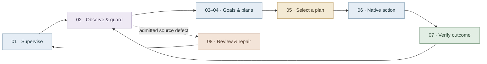

# JEV Factorio workflow atlas

A source-reviewed map of campaign supervision, planning, native execution, and
recovery. Reviewed against [`761ffc8`](https://github.com/CompleteDotTech/jev-factorio-agent/tree/761ffc8),
including the partial gameplay and latency changes in PR #108. The maps describe
implemented branches and optional capabilities; they do not attest a live
campaign's configuration, deployment, or native acceptance.



## Explore the diagrams

Start with the complete map for relationships, then open a section image at full
size for its decisions and failure paths. SVG downloads retain crisp text at any
zoom; PNGs provide reliable previews. Every section is generated from the
same master, including its cross-section continuation nodes.

| Map | Focus | Mermaid | Full-resolution image |
| --- | --- | --- | --- |
| 00 · Complete workflow | All eight connected sections | [Source](mmd/00-complete-workflow.mmd) | [PNG](pngs/00-complete-workflow.png) · [SVG](svgs/00-complete-workflow.svg) |
| 01 · Campaign supervision | Original cutoff, locks, admission and health | [Source](mmd/01-campaign-supervision.mmd) | [PNG](pngs/01-campaign-supervision.png) · [SVG](svgs/01-campaign-supervision.svg) |
| 02 · Hierarchical controller | Observations, barriers, planning and durable dispatch | [Source](mmd/02-hierarchical-controller.mmd) | [PNG](pngs/02-hierarchical-controller.png) · [SVG](svgs/02-hierarchical-controller.svg) |
| 03 · Goals and bootstrap | Goal predicates and bounded bootstrap actions | [Source](mmd/03-goals-and-bootstrap.mmd) | [PNG](pngs/03-goals-and-bootstrap.png) · [SVG](svgs/03-goals-and-bootstrap.svg) |
| 04 · Factory planning | Serial and ready-work planning, optional production capabilities | [Source](mmd/04-factory-dependency-planner.mmd) | [PNG](pngs/04-factory-dependency-planner.png) · [SVG](svgs/04-factory-dependency-planner.svg) |
| 05 · JEV judgment | Model admission, batched scoring and fallback policy | [Source](mmd/05-jev-candidate-judgment.mmd) | [PNG](pngs/05-jev-candidate-judgment.png) · [SVG](svgs/05-jev-candidate-judgment.svg) |
| 06 · Native execution | Paid actions, physical movement and adapter boundaries | [Source](mmd/06-native-action-execution.mmd) | [PNG](pngs/06-native-action-execution.png) · [SVG](svgs/06-native-action-execution.svg) |
| 07 · Pending verification | Receipts, reconciliation, timeouts and background craft | [Source](mmd/07-pending-action-verification.mmd) | [PNG](pngs/07-pending-action-verification.png) · [SVG](svgs/07-pending-action-verification.svg) |
| 08 · Reviewed repair | Evidence-gated source repair and operational acceptance | [Source](mmd/08-automatic-codex-repair.mmd) | [PNG](pngs/08-automatic-codex-repair.png) · [SVG](svgs/08-automatic-codex-repair.svg) |

## Reading the colors

The warm ivory canvas reduces glare. Muted fills group the role of each node,
while dark text, diamond decisions, labeled arrows and dashed continuations keep
the diagrams understandable without relying on color alone.

| Color | Meaning |
| --- | --- |
| Slate blue | Processing, planning and execution |
| Lavender | Observations, checkpoints and evidence |
| Warm amber | Decisions and eligibility gates |
| Sage | Verified outcomes and accepted transitions |
| Soft clay | Recovery, retries and caution |
| Dusty rose | Stop, block or unresolved ownership |
| Mist gray with dashed outline | Continuation into another section |

## Source map and scope

| Section | Implementation to follow |
| --- | --- |
| Supervision | [supervisor.py](../../src/jev_factorio/supervisor.py), [recovery_policy.py](../../src/jev_factorio/recovery_policy.py), [operational_safety.py](../../src/jev_factorio/operational_safety.py) |
| Controller | [controller.py](../../src/jev_factorio/controller.py), [main.py](../../src/jev_factorio/main.py), [checkpoint_io.py](../../src/jev_factorio/checkpoint_io.py), [background.py](../../src/jev_factorio/background.py) |
| Goals and bootstrap | [goals.py](../../src/jev_factorio/planning/goals.py), [skills.py](../../src/jev_factorio/skills.py) |
| Factory planning | [factory.py](../../src/jev_factorio/planning/factory.py), [ready_work.py](../../src/jev_factorio/planning/ready_work.py), [fuel_service.py](../../src/jev_factorio/planning/fuel_service.py), [capital_controller.py](../../src/jev_factorio/capital_controller.py) |
| Model judgment | [controller.py](../../src/jev_factorio/controller.py), [judgments.py](../../src/jev_factorio/judgments.py), [provider_health.py](../../src/jev_factorio/provider_health.py), [jev_client.py](../../src/jev_factorio/jev_client.py) |
| Native actions | [fle.py](../../src/jev_factorio/backends/fle.py), [native_factory.py](../../src/jev_factorio/backends/native_factory.py), [fair_actions.py](../../src/jev_factorio/backends/fair_actions.py), [native Lua](../../src/jev_factorio/lua/fair_actions.lua) |
| Verification | [controller.py](../../src/jev_factorio/controller.py), [background.py](../../src/jev_factorio/background.py), [transfer_recovery.py](../../src/jev_factorio/transfer_recovery.py), [craft_jobs.py](../../src/jev_factorio/craft_jobs.py) |
| Repair acceptance | [supervisor.py](../../src/jev_factorio/supervisor.py), [prevalidation.py](../../src/jev_factorio/prevalidation.py) |

The CLI defaults to the flat controller and serial factory scheduling. This atlas
focuses on the hierarchical campaign path and labels its optional ready-work,
background-craft, buffer, input-route and investment capabilities. The standalone
CLI accepts a model and policy; the current supervisor launch command pins hybrid
policy and `jev-1.13.0`. Cadence, enabled features and the original cutoff follow
the validated configuration. None of these maps is a live deployment readback.

JEV selects among code-generated plans. A hybrid ready-work singleton can skip a
model call, and provider admission holds do not become permission to fall back.
Mutations of the controlled actor remain sequential. Existing machines and
receipt-tracked crafting can progress while independent permitted work is chosen.

Commissioned furnace buffers and specific paid furnace-input/mining routes exist.
General solid-item routing, coal distribution networks and downstream ingredient
transport from tracker #103 are still unfinished; see the
[implementation boundary](../ISSUE_103_OFFLINE_IMPLEMENTATION.md). Grouped manual
fuel acquisition is not a coal conveyor network.

A failed or ambiguous action does not automatically authorize repair or replay.
The supervisor uses explicit recovery classification and durable evidence. Its
source-repair admission path requires positive source-defect evidence; the normal
exit-record producer currently records storage, uncertainty or unclassified
failures, so an ordinary exit alone does not supply that admission. Review
[reliability recovery](../RELIABILITY_RECOVERY.md) and
[status recovery](../STATUS_RECOVERY.md) before operational intervention. Diagrams
are navigational documentation; the executable checks remain authoritative.

Observation and persistence are evidence boundaries, not parallel dispatch paths.
The [craft inventory adapter](../../src/jev_factorio/backends/craft_jobs.py) must
validate same-tick inventory before the FLE backend omits its duplicate inventory
read. [Observation timing](../../src/jev_factorio/observation.py) separates wall
and whole-process CPU time; nested inclusive counters must not be added together.
Opaque transport and retry timing remain unknown. Checkpoint capture can reuse an
exact unchanged detached state, while changed authoritative state still crosses
file and directory durability barriers.

All eight sections received source review and cross-section review. The rendered
complete graph has 243 unique nodes; all nine diagrams were rendered and checked
for label and node clipping. This validates documentation and rendering, not
native gameplay or deployment.

## Regenerate

Edit [the complete Mermaid source](mmd/00-complete-workflow.mmd), including its
semantic classes and section colors. The eight section sources are generated;
do not maintain them independently. The renderer carries the shared palette into
each section and marks external nodes with dashed outlines.

Source-only regeneration needs Python 3:

```sh
python docs/workflows/render.py --split-only
```

Full rendering needs Python 3 with Pillow, Node.js, Mermaid CLI **11.17.0**, and
Chromium or Edge. It executes no gameplay commands. Browser and font versions can
change pixel layout; the manifest records exact source/configuration/image hashes,
including the effective layout configuration, actual dimensions, scales and file
sizes for the generated artifacts.

```sh
PUPPETEER_SKIP_DOWNLOAD=true npm install --prefix runs/mermaid-render \
  --no-audit --no-fund @mermaid-js/mermaid-cli@11.17.0
python docs/workflows/render.py \
  --mmdc runs/mermaid-render/node_modules/.bin/mmdc \
  --browser /absolute/path/to/chromium
```

On Windows, use the `.bin/mmdc.cmd` path and an installed Edge/Chromium executable.
The renderer invokes Node directly, so paths with spaces are supported. Use
`--only 05-jev-candidate-judgment` for an individual render. Partial renders
regenerate only the selected section source; overview-only renders leave all
section sources and images unchanged. `--split-only --only <stem>` likewise
limits source generation to that section. Regenerate all images after changing
shared styles or when publishing changes across the complete map.
Successful partial renders remove manifest records whose source or shared theme
digest is outdated; regenerate those images to restore their manifest entries.
Generated section sources and images are staged until all selected rendering
finishes. A renderer failure leaves published sources, images and manifest unchanged;
`--split-only` stages and writes section sources without rendering images. It
invalidates manifest records whose source or shared theme digest is now stale,
while preserving image files and still-current records. Invalid split inputs
leave the published sources and manifest unchanged.

PNG images default to 2x scale. The renderer caps oversized outputs at 30,000
pixels per axis and approximately 160 megapixels, captures browser tiles, and
assembles them without rescaling. This prevents clipping of large maps. Temporary
SVGs, tiles, browser configuration and optional extracted Linux libraries live
under ignored `runs/mermaid-render/`; generated SVGs, PNGs and their
[manifest](pngs/manifest.json) belong in this directory.
